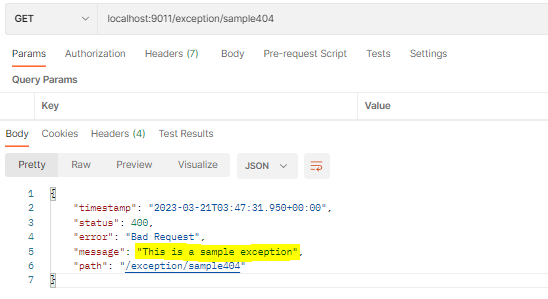
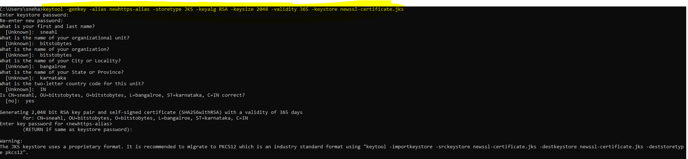
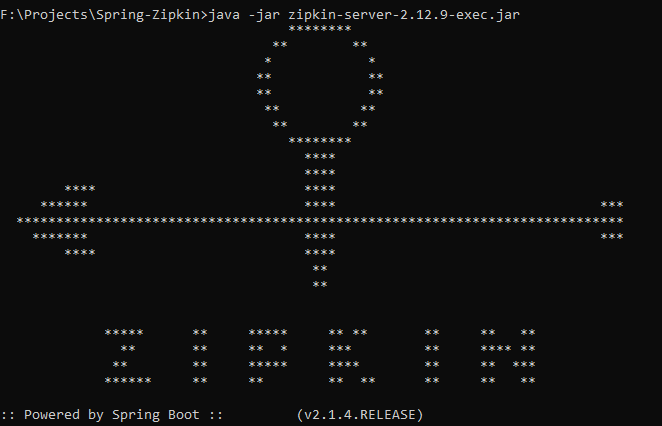

#LOGGING

mostly used logging pattern:<br>
*%clr(%d{${LOG_DATEFORMAT_PATTERN:-yyyy-MM-dd HH:mm:ss.SSS}}){faint} %clr(${LOG_LEVEL_PATTERN:-%5p}) %clr(${PID:- }){magenta} %clr(---){faint} %clr([%15.15t]){faint} %clr(%-40.40logger{39}){cyan} %clr(:){faint} %m%n${LOG_EXCEPTION_CONVERSION_WORD:-%wEx}*

clr means color. The following colors are supported:
1. blue
2. cyan
3. faint
4. green

When a file in the classpath has one of the following names, Spring Boot will automatically load it over the default configuration:

1. logback-spring.xml
2. logback.xml
3. logback-spring.groovy
4. logback.groovy

## MDC
we can create a filter which will generate a random UUID and can be passed in every request. This will help in tracking the flow.
sample Code:
```java
@Component
public class MDCFilter extends OncePerRequestFilter {

    @Override
    protected void doFilterInternal(HttpServletRequest request, HttpServletResponse response, FilterChain filterChain)
            throws ServletException, IOException {
        MDC.put("tracking", request.getHeader("tracking-header"));
        try {
            filterChain.doFilter(request, response);
        } finally {
            MDC.clear();
        }
    }
}
```

#EXCEPTION HANDLING IN SPRING BOOT

Some annotations that spring boot provides:
1. @ResponseStatus
2. @ExceptionHandler
3. @ControllerAdvice

the property **server.error.include-message=always** sends the message of exception in the response.



properties of logger:
[click here](https://docs.spring.io/spring-boot/docs/current/reference/html/application-properties.html#appendix.application-properties.server)


@ResponseStatus specifies the status of Http request to be sent as response.

@ExceptionHAndler as the name suggests, it handles the excpetion. Whenever we annotate a method with ExceptionHandler and provide the name of the exception to be handled, the particular method is called just before sending the response and will be executed.

eg:
```java
@ExceptionHandler(Sample404ExceptionClass.class)
    @ResponseStatus(HttpStatus.BAD_REQUEST)
    public ResponseEntity<String> handleSample404Exception(Sample404ExceptionClass e) {
        log.info("handling Sample404 Exception using Exception handler");
        return ResponseEntity
                .status(HttpStatus.BAD_REQUEST)
                .body(e.getMessage());
    }
```

Here whenever a Sample404Exception is supposed to be thrown, the handleSample404Exception method is called.

But for @ExceptionHandler to be executed, we need @ControllerAdvice or @RestControllerAdvice on top of the class.

```java
@ControllerAdvice
public class AllExceptionHandler {

    @ExceptionHandler(Sample404ExceptionClass.class)
    @ResponseStatus(HttpStatus.BAD_REQUEST)
    public ResponseEntity<String> handleSample404Exception(Sample404ExceptionClass e) {
        log.info("handling Sample404 Exception using Exception handler");
        return ResponseEntity
                .status(HttpStatus.BAD_REQUEST)
                .body(e.getMessage());
    }
}
```

#Generate SSL cerificate

keytool -genkey -alias newhttps-alias -storetype JKS -keyalg RSA -keysize 2048 -validity 365 -keystore newssl-certificate.jks


getting exception:
```aidl
Caused by: org.apache.catalina.LifecycleException: Protocol handler start failed
	at org.apache.catalina.connector.Connector.startInternal(Connector.java:1076)
	at org.apache.catalina.util.LifecycleBase.start(LifecycleBase.java:183)
	at org.apache.catalina.core.StandardService.addConnector(StandardService.java:234)
	... 18 common frames omitted
Caused by: java.lang.IllegalArgumentException: Keystore was tampered with, or password was incorrect
	at org.apache.tomcat.util.net.AbstractJsseEndpoint.createSSLContext(AbstractJsseEndpoint.java:107)
	at org.apache.tomcat.util.net.AbstractJsseEndpoint.initialiseSsl(AbstractJsseEndpoint.java:71)
	at org.apache.tomcat.util.net.NioEndpoint.bind(NioEndpoint.java:235)
	at org.apache.tomcat.util.net.AbstractEndpoint.bindWithCleanup(AbstractEndpoint.java:1227)
	at org.apache.tomcat.util.net.AbstractEndpoint.start(AbstractEndpoint.java:1313)
	at org.apache.coyote.AbstractProtocol.start(AbstractProtocol.java:615)
	at org.apache.catalina.connector.Connector.startInternal(Connector.java:1073)
	... 20 common frames omitted
Caused by: java.io.IOException: Keystore was tampered with, or password was incorrect
	at java.base/sun.security.provider.JavaKeyStore.engineLoad(JavaKeyStore.java:813)
	at java.base/sun.security.util.KeyStoreDelegator.engineLoad(KeyStoreDelegator.java:221)
	at java.base/java.security.KeyStore.load(KeyStore.java:1473)
	at org.apache.tomcat.util.security.KeyStoreUtil.load(KeyStoreUtil.java:69)
	at org.apache.tomcat.util.net.SSLUtilBase.getStore(SSLUtilBase.java:217)
	at org.apache.tomcat.util.net.SSLHostConfigCertificate.getCertificateKeystore(SSLHostConfigCertificate.java:207)
	at org.apache.tomcat.util.net.SSLUtilBase.getKeyManagers(SSLUtilBase.java:283)
	at org.apache.tomcat.util.net.SSLUtilBase.createSSLContext(SSLUtilBase.java:247)
	at org.apache.tomcat.util.net.AbstractJsseEndpoint.createSSLContext(AbstractJsseEndpoint.java:105)
	... 26 common frames omitted
Caused by: java.security.UnrecoverableKeyException: Password verification failed
	at java.base/sun.security.provider.JavaKeyStore.engineLoad(JavaKeyStore.java:811)
	... 34 common frames omitted
```

Solution:
The property was not proper
instead of server.ssl.key-password we need to use server.ssl.key-store-password
```mermaid
server.ssl.key-alias=newhttps-alias
server.ssl.key-store=newssl-certificate.jks
server.ssl.key-store-type=jks
server.ssl.key-store-password=mypass@1
```


##SWAGGER
[link for annotations](https://www.javainuse.com/spring/boot_swagger_annotations)

##ZIPKIN-SERVER JAR
[maven-jars](https://repo1.maven.org/maven2/io/zipkin/java/zipkin-server/)

download the latest zipkin server jar and run in local using command:
```java
java -jar zipkin-server-2.12.9-exec.jar
```
the server will be running at port 9411 by default


